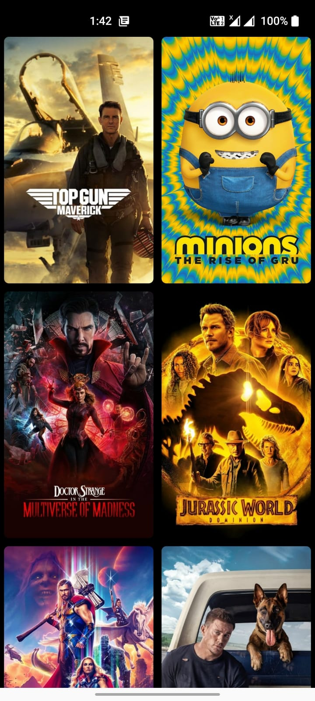

# Movie-Mania
This is a demo app that fetches list of Popular movies from the [The Movie DB](https://www.themoviedb.org/)

* Uses okHttp3 as network transport.
* Uses Glide for image loading and caching.
* Uses Retrofit for networking.
* Uses romm for caching.
* Uses Gson for json parsing.
* Follows MVVM(Model-View-ViewModel) archietecture.

